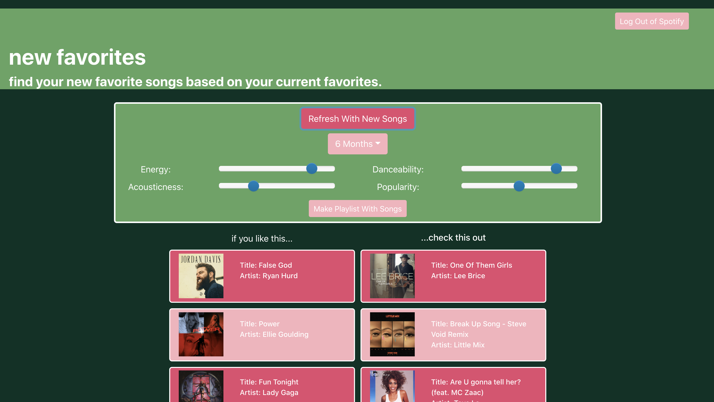

# new-favorite

A React app to find your new favorite songs! 

Generate a playlist of reccommended songs based on your most listened to songs from the past 4 weeks, 6 months, or all time.
Change these reccommendations based on filters like danceability, acousticness, popularity, and more!



How to Run:
- download or clone this repo
- in ../new-favorite:
    ```sh
    npm start
    ```
- in ../new-favorite/my-client:
    ```sh
    npm start
    ```
- a new window or tab will open with to a page where you can log into Spotify and get started!
